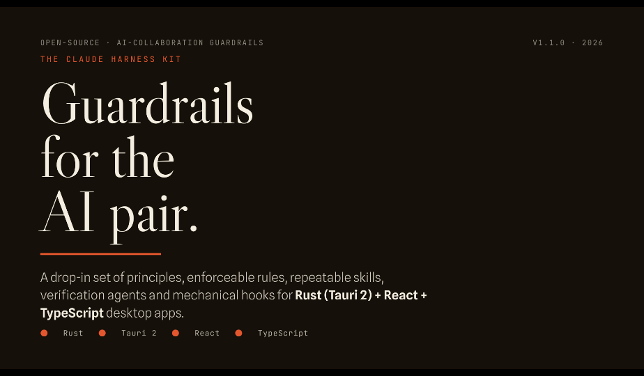

# Claude Harness Kit

**v1.2.0** — A drop-in set of AI-collaboration guardrails for
**Rust (Tauri 2) + React + TypeScript** desktop apps: principles, enforceable
rules, repeatable skills, fill-in forms, verification agents, mechanical
hooks, review procedures, and CI/PR templates.

[](https://kumeS.github.io/RUST-Tauri-claude-harness-kit/)

Extracted from a real, shipping Tauri 2 desktop application (~16k LOC,
84 Rust tests + 41 vitest tests) that went through three generations of deep
post-mortem analysis. Every rule in this kit traces to a bug that actually
happened, a promise that actually drifted, or a pattern that actually
survived multiple release cycles — provenance is documented in
[AUDIT.md](AUDIT.md). The constitution's *shape* is borrowed from Anthropic's
own production system prompts, and the design layer from Claude Design's —
sources preserved in [others/](others/README.md).

> **The one-sentence version:** every promise gets a test, or an explicit
> "planned" label. A codebase's strong areas are exactly the promises guarded
> by tests; its weak areas are exactly the promises guarded by goodwill.

**v1.1 in one sentence:** rules you *ask* an agent to follow and rules the
*system enforces* are different layers — the kit ships both (rules/skills
ask; `settings.json` + hooks enforce; agents verify).

**v1.2 in one sentence:** the harness now scales down to weaker models —
"done" claims, task routing, compile feedback, and anti-shortcut discipline
are checked mechanically instead of trusted, and skill outputs become
fill-in forms.

---

## ⚠️ Which files go into your project — and which do not

**`README.md` (this file), `AUDIT.md`, and `others/` are documentation *of
this kit repository*. They are NOT used by adopting projects — do not copy
them into your codebase.** Everything else is designed to be copied.

| Path | Copy into your project? | Notes |
|------|------------------------|-------|
| `README.md` | ❌ **No** | Describes the kit itself (this file). |
| `AUDIT.md` | ❌ **No** | Provenance record of the source codebase. Reference reading only. |
| `others/` | ❌ **No** | Raw source system prompts the kit was optimized against. |
| `.nojekyll` / `_config.yml` | ❌ **No** | Kit-repo GitHub Pages plumbing: keeps every Pages/Jekyll pipeline from rendering the kit's markdown (see `.claude/agent-memory/pitfalls.md`). |
| `CLAUDE.md` | ✅ Yes → repo root | Fill every `{{PLACEHOLDER}}`, delete non-applicable lines. |
| `AGENTS.md` | ✅ Yes → repo root | Agent-layer index; entry point for non-Claude tools. |
| `docs/ai/00–11_*.md` | ✅ Yes → `docs/ai/` | Reference docs, loaded on demand by AI sessions. (09 is optional agent self-notes — adopt only if useful, and replace its incident log with your own.) |
| `.claude/rules/*.md` | ✅ Yes → `.claude/rules/` | Enforceable per-domain constraints. |
| `.claude/skills/*/SKILL.md` | ✅ Yes → `.claude/skills/` | Trigger-driven procedures. |
| `.claude/forms/*.md` | ✅ Yes → `.claude/forms/` | Fill-in output forms for the skills (spec, exploration, escalation). |
| `.claude/agents/*.md` | ✅ Yes → `.claude/agents/` | Read-only verification subagents. |
| `.claude/agent-memory/` | ✅ Yes → `.claude/agent-memory/` | Starter convention for accumulated pitfalls/decisions. |
| `.claude/settings.json` | ✅ Yes → `.claude/` | Mechanical layer: denied commands + hook registration. Merge if you already have one. |
| `.claude/hooks/*.sh` | ✅ Yes → `.claude/hooks/` | Keep executable (`chmod +x`). Fail open without python3. |
| `.claude/launch.json` | ❌ No | Kit-repo preview server config. |
| `templates/ci.yml` | ✅ Yes → `.github/workflows/ci.yml` | Adjust the working-directory if your app is nested. |
| `templates/pull_request_template.md` | ✅ Yes → `.github/pull_request_template.md` | Condensed from the review checklist. |
| `templates/README.md` | ❌ No | Explains the templates; not needed after moving them. |
| `.gitignore` | ❌ No | Kit-repo housekeeping — but the `.claude/settings.local.json`, `.claude/cache/`, and `CLAUDE.local.md` lines are worth adding to yours. |

## Quick start

```bash
# from your project root
cp -r <kit>/docs ./          # → docs/ai/*
cp -r <kit>/.claude ./       # → rules, skills, forms, agents, hooks, agent-memory, settings.json
rm .claude/launch.json       # kit-repo only
chmod +x .claude/hooks/*.sh
cp <kit>/CLAUDE.md ./        # then fill in every {{PLACEHOLDER}}
cp <kit>/AGENTS.md ./
mkdir -p .github/workflows
cp <kit>/templates/ci.yml .github/workflows/ci.yml
cp <kit>/templates/pull_request_template.md .github/
```

Then:

1. Fill in `CLAUDE.md` (project name, personality, commands, paths).
   It is deliberately short — if it grows past ~130 lines, push content into
   `docs/ai/`.
2. Open `.claude/settings.json` and review the deny list + hooks against
   your team's tolerance. The two heaviest hooks are tunable:
   `check-on-edit.sh` (per-edit compile check — remove it if your crate's
   `cargo check` is slow) and `done-gate.sh` (runs suites when a turn ends
   with modified code — `DONE_GATE=off` skips it for deliberate WIP).
   Local overrides go in `settings.local.json` (gitignored).
3. Open `.github/workflows/ci.yml` and set the working directory / package
   paths for your repo layout.
4. Read `docs/ai/00_harness_overview.md` (5 minutes) — it explains how the
   six layers (constitution → references → rules → skills → agents →
   enforcement) are meant to be loaded during AI sessions, and how the
   balance shifts toward enforcement for weaker models.
5. Resolve the six **[D] Needs-confirmation** decisions listed in
   `AUDIT.md §4` for your product (atomic writes, dark mode, CI provider,
   platform matrix, UI i18n, headless-twin commitment). Deciding them on
   day one is cheap; retrofitting is not.
6. Delete or rewrite anything marked **[C] Project-specific** — those are
   worked examples from the source app (its palette values, its chunk data
   model), kept for concreteness, not as defaults.

## What's inside

```
claude-harness-kit/
├── README.md                  ← kit docs (do not copy)
├── AUDIT.md                   ← provenance (do not copy)
├── others/                    ← source system prompts (do not copy)
├── CLAUDE.md                  ← template: always-loaded constitution
├── AGENTS.md                  ← agent-layer index / non-Claude entry point
├── docs/ai/
│   ├── 00_harness_overview.md     how the six layers fit together
│   ├── 01_project_principles.md   8 principles, with receipts
│   ├── 02_architecture_patterns.md Rust/IPC/layering patterns
│   ├── 03_ui_constitution.md      product personality + UI principles
│   ├── 04_design_tokens.md        token policy (+ replaceable example set)
│   ├── 05_feature_taste_guide.md  what to build, and how it should feel
│   ├── 06_tauri_permission_policy.md permissions + CSP stance
│   ├── 07_state_model_patterns.md store/undo/staleness/routing patterns
│   ├── 08_review_checklist.md     the pre-merge walk
│   ├── 09_agent_tool_call_syntax.md agent self-notes (optional)
│   ├── 10_blind_spot_audit.md     product-interrogation method
│   └── 11_design_craft.md         aesthetics, typography, the anti-slop list
├── .claude/
│   ├── settings.json   denied commands + hook registration (the enforced layer)
│   ├── hooks/          protect · done-gate · check-on-edit · anti-shortcut
│   │                   · prompt-router · context-refresh
│   │                   · permission-surface-reminder · format-on-edit
│   │                   · test_hooks.sh (the guards' own test matrix)
│   ├── rules/          ui · rust · react · tauri-permissions · testing
│   │                   · escalation
│   ├── skills/         feature-spec · ui-polish · tauri-permission-review
│   │                   · ipc-command-design · rust-error-design
│   │                   · design-exploration · blind-spot-audit
│   ├── forms/          feature-spec · exploration-record · escalation-report
│   ├── agents/         plan-gatekeeper · code-review · adversarial-reviewer
│   │                   · scope-guard · permission-auditor · design-critic
│   └── agent-memory/   accumulated pitfalls & decisions (starter)
└── templates/          ci.yml · pull_request_template.md · README.md
```

## The six layers (short version)

| Layer | Ships as | Guards against |
|-------|----------|----------------|
| Constitution | `CLAUDE.md` | working without invariants |
| References | `docs/ai/` | re-deriving rationale from scratch |
| Rules | `.claude/rules/` | domain-specific known failure modes |
| Skills | `.claude/skills/` + `.claude/forms/` | improvising procedures that have a right order |
| Agents | `.claude/agents/` | the implementer reviewing only its own work |
| Enforcement | `settings.json` + `hooks/` | the day persuasion fails |

## Scaling down to weaker models

The prose layers assume a model that reads, retains, and honestly
self-assesses. v1.2 adds the pieces that hold when those assumptions don't
(full rationale: docs/ai/00 §"Scaling down to weaker models"):

- **done-gate** (Stop hook) — ends a turn with modified code? The suites
  run mechanically; red output blocks the "done" and is fed back verbatim.
- **check-on-edit** (PostToolUse) — `cargo check` / `tsc --noEmit` per
  edit, so drift is caught one step after it starts.
- **anti-shortcut tripwire + rules/escalation.md** — deleted tests,
  `.only`/`.skip`, `@ts-ignore`/`as any`, `todo!()` are detected in the
  diff and must be fixed or justified; two failed fixes force a written
  escalation instead of a third guess.
- **prompt-router** (UserPromptSubmit) — CLAUDE.md's task routing becomes
  keyword-mechanical instead of trusting the model to read the table.
- **context-refresh** (SessionStart, compact) — the invariants survive
  context compaction by re-injection.
- **forms** — spec, exploration, and escalation outputs are fill-in forms;
  a half-filled form is visibly unfinished.
- **plan-gatekeeper / scope-guard** — narrow-rubric verification brackets
  the implementation (plan before, diff-vs-ask after); checking against a
  rubric works even when the checker is the same weak model.

Hooks are best-effort tripwires, not a sandbox — design constraints and the
disable switches are documented in `.claude/hooks/README.md`.

## Provenance markers used throughout

- **[FACT]** — observed directly in the source codebase
- **[REC]** — recommendation derived from an observed failure/success
- **[A]** universal · **[B]** generalize-then-use · **[C]** do not port ·
  **[D]** needs a per-project decision

## Assumptions & scope

- Target stack: **Tauri 2 + Rust backend, React + TypeScript frontend**
  (state-library guidance is written against Zustand but is store-agnostic).
- Not on Tauri? Drop `06_tauri_permission_policy.md`,
  `.claude/rules/tauri-permissions.md`, the `tauri-permission-review` skill,
  the `permission-auditor` agent, and the permission-surface hook — the rest
  is stack-light.
- Hooks require `bash` + `python3` (standard on macOS/Linux dev machines);
  they fail open — never blocking work — when python3 is absent. The hook
  matrix (`bash .claude/hooks/test_hooks.sh`) runs in CI via the kit's
  workflow template.
- The kit contains **no application code** — only documentation, rules,
  skills, forms, agents, hooks, and CI/PR configuration templates.

## License

Add a license before publishing forks/derivatives. The kit text itself
carries no code; a documentation-friendly license (MIT / CC-BY-4.0) is a
natural fit. (This repository's owner chooses; the kit does not impose one.)
